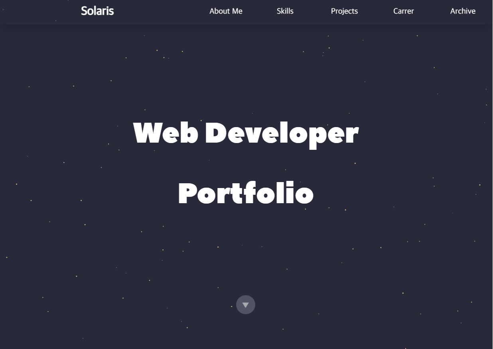

# 포트폴리오
> 포트폴리오 용도로 개발

Tailwind CSS도 공부 및 자기소개 목적으로 제작한 프로젝트입니다.
개발을 진행하며 기존 CSS에 비해 초기 서비스 구축 시간이 짧다는 걸 체감할 수 있었고 특히 반응형 디자인을 수정할 때 기준점을 정해주는 클래스명이 있다보니 개발 시간을 많이 단축할 수 있었습니다.

Bootstrap의 [Creative](https://startbootstrap.com/theme/creative) 템플릿의 디자인을 참고하여 개발했습니다.



## 기술스택
* Env  
    
    
      
      
*  Config  
      
* Dev  
    
    
    
    
## 개발 환경 설정

```sh
cd solarisintro
npm install
npm test
```

## 업데이트 내역

* 0.1.0
    * 출시